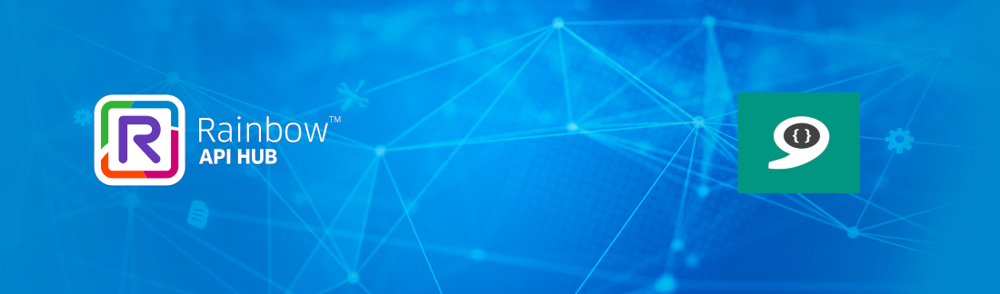
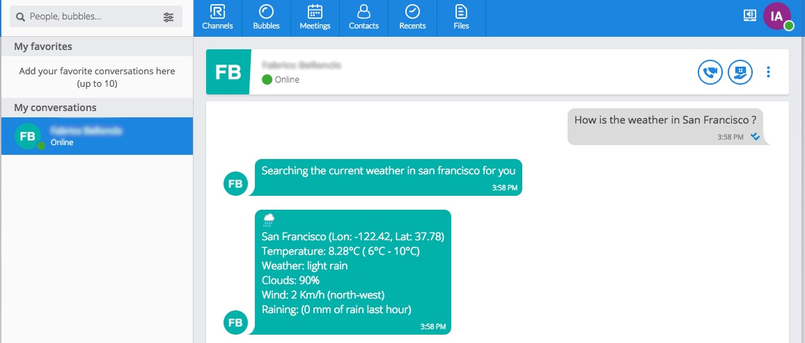
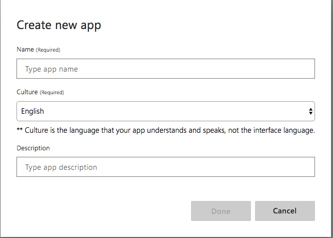

# Rainbow bot using Microsoft Luis sample

## Introduction

This is a sample of how a NodeJS Rainbow bot can easily use the Microsoft Luis capabilities.
The user can ask for current weather or forecast in a location with natural language. 
For example:  
"How is the weather in San Francisco ?",  
"How will the weather be in the coming days in London?"



## Preparing the LUIS application 
You need to have an account on https://www.luis.ai 
1. **App and Intents**:  
From there create a new App "luis-rainbow"  
**Select the English culture in the Create new app popup**  

* create one intent: **queryWeather** with the following utterances:  
`What is the weather like in paris ?`  
`Weather in Boston next week ?`  
`How's the weather in Sydney today ?`  
`Will it rain in Tokyo in april ?`  
`Is it sunny in Washington this afternoon ?`  
`Forecast of next week in Seattle`   
`Give me the weather forecast for London`  

*  Don't forget to feed the intent **None** with some samples of unrelated questions (e.g.)  
`How far is the moon from earth`  
`Penguins cannot fly`  
`What did people eat during world war two ?`  
`Asia is very large`  

2. **Entities**:  
Add the following pre-built entities to your application:
* **datetimeV2**
* **geographyV2**

3. **Train the application and publish it.**  
From the "Keys and Endpoints" part of the "Manage" section, you can retrieve the "Endpoint" url that you 
will use in the json configuration file.


## Installation

To install, just clone this repository, and type:

```bash
npm install
```

## Usage

### Requirements

To be able to play with this sample bot you need:  
* Your Rainbow developer account (you can create one from here: https://hub.openrainbow.com),
* A Microsoft Luis endpoint URL (https://www.luis.ai),
* An OpenWeatherMap API key (https://openweathermap.org).

### Configuration

You can now configure the credentials and options for the Rainbow SDK, for 
Microsoft Luis and OpenWeatherMap. 
This sample uses the **config** module (https://www.npmjs.com/package/config).

A `config/default.json` file is provided. We recommend you make a copy of this file 
and name it `config/local.json`. The `local.json` file is used to locally store 
your credentials without pushing them in a git (this file is part of .gitignore).
There are three parts in this configuration file: one for Rainbow, one for Luis and
one for OpenWeatherMap.
Replace each value between `<` and `>` wih your associated credentials.

If you plan to use the bot in Docker, please refer to the **Docker** section below
for configuration in this case.

### Running

To start, just type:

```bash
npm start
```

### Logs

Using the default configuration in `config/default.json`, Rainbow SDK logs will
be stored in the `logs` subdirectory (file with name `<date>-rainbowsdk.log`):

```javascript
        "logs": {
            "enableConsoleLogs": false,
            "enableFileLogs": true,
            "file": {
                "path": "logs",
                "level": "debug"
            }
        },    
```

Bot logs will also be stored in the `logs` directory, in a file named `rainbow-luis-sample.log`.

## Docker

This sample can also be used in docker.

### Configuration

You can configure the credentials (Rainbow SDK, Microsoft Luis and 
OpenWeatherMap) by editing the file `bot_env_file`. The environment variables embedded
in `bot_env_file` will be used by `config/custom-environment-variables.json` file.

### Building the docker image

To build the docker image type:

```bash
docker build -t rainbow-luis-sample .
```

### Starting the bot service

The bot service can be started by typing:

```bash
docker-compose up
```

## Bot architecture

The sample bot is divided in different parts:
* `app.js` : main file of the application, interfaces with Rainbow
* `module/bot.js`: handle user messages with the help of luis and openweathermap modules, sends back response (event emitter)
* `module/luis.js`: this does the job to send a user sentence to Luis, and get back the result (intents, entities)
* `module/openweathermap.js`: interfaces with OpenWeatherMap service.

The bot subscribes to Rainbow SDK **rainbow_onmessagereceived** events 
(https://hub.openrainbow.com/#/documentation/doc/sdk/node/api/events#Events+event_rainbow_onmessagereceived).

When the receive message type is **chat** message we give it to the bot module (**handleMessage**) and
we mark the message as read (https://hub.openrainbow.com/#/documentation/doc/sdk/node/api/im#IM+markMessageAsRead).  
The bot.js **handleMessage** function sends the message to Luis and gets back intents and entities.  
Given the intents / entities combination, it calls the openweathermap module to get weather information.  
Response messages are sent back to `app.js` using the **sendIM** event. `app.js` listens to **sendIM** bot 
messages.  
The **sendIM** handler calls the Rainbow SDK to send the message to the user 
(https://hub.openrainbow.com/#/documentation/doc/sdk/node/api/im#IM+sendMessageToJid).